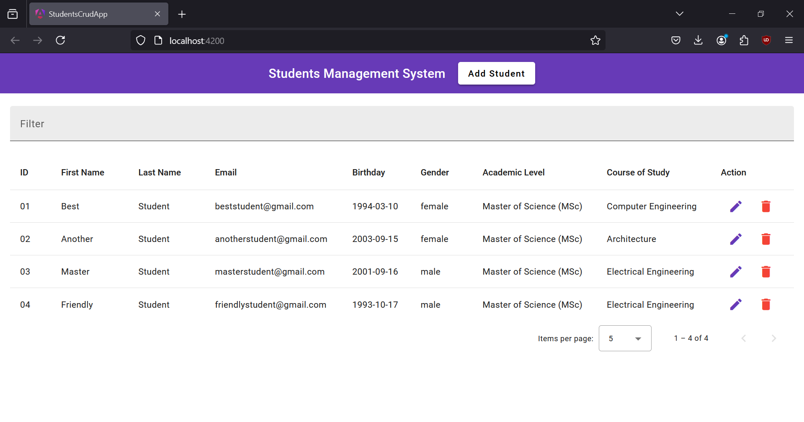
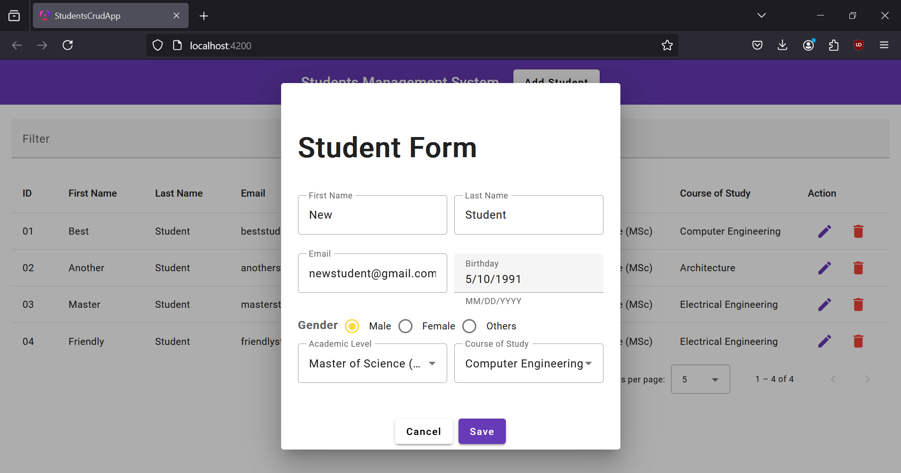
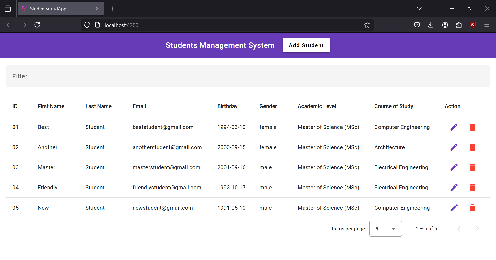
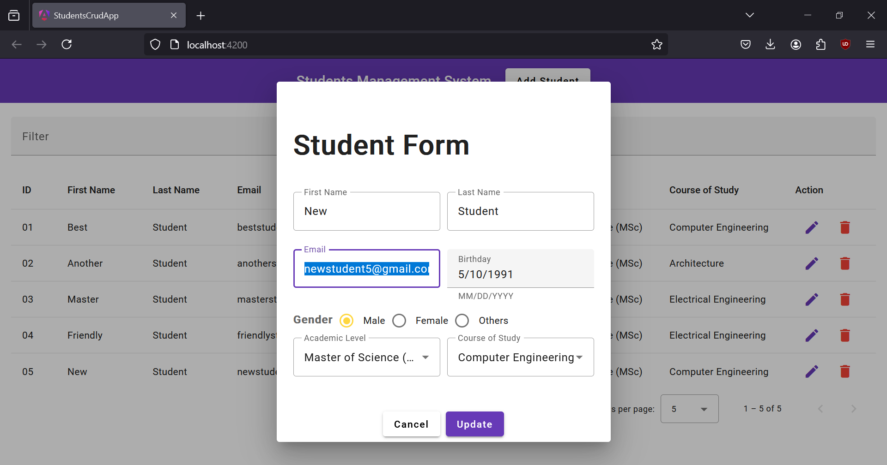
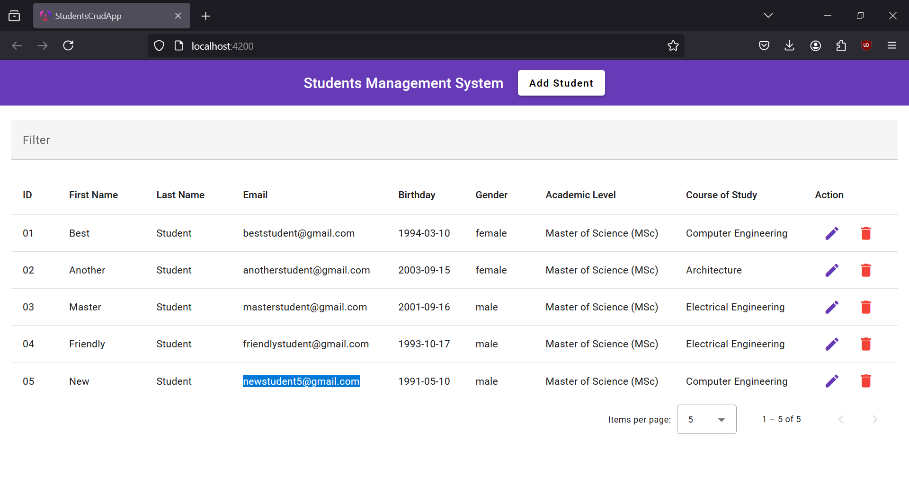
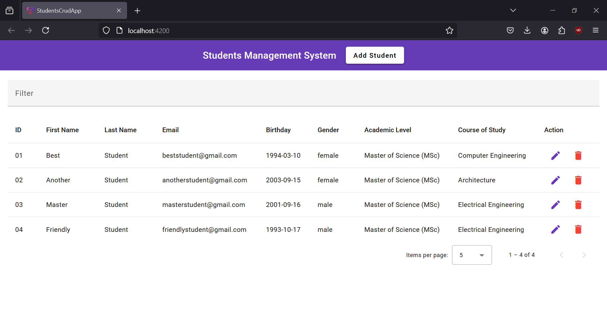

# Students Management System

Student Management System is a CRUD application to Create, Read, Update and Delete data of students. Angular framework and Angular Material component library are used to build a good web interface and modify components.

## Dependencies

The following dependencies must be installed before running the project:
 - Angular Material: [Installation guide](https://material.angular.io/guide/getting-started)
 - JSON Server: [Installation guide](https://www.npmjs.com/package/json-server)

#### Commands to install and run dependencies

Run the following commands to install Angular Material, JSON Server and finally run the project:

```console
$ ng add @angular/material
$ npm install json-server
$ npx json-server db.json
$ ng serve
```

## Demonstration

| Read: Dashboard view                                        |
|-------------------------------------------------------------|
|  |

| Create: Add student form                                      | Student added successfully                                              |
|---------------------------------------------------------------|-------------------------------------------------------------------------|
|  |  |

| Update: Update email field of student                            | Email field updated successfully                                          |
|------------------------------------------------------------------|---------------------------------------------------------------------------|
|  |  |

| Delete: Student deleted successfully                                      |
|---------------------------------------------------------------------------|
|  |
