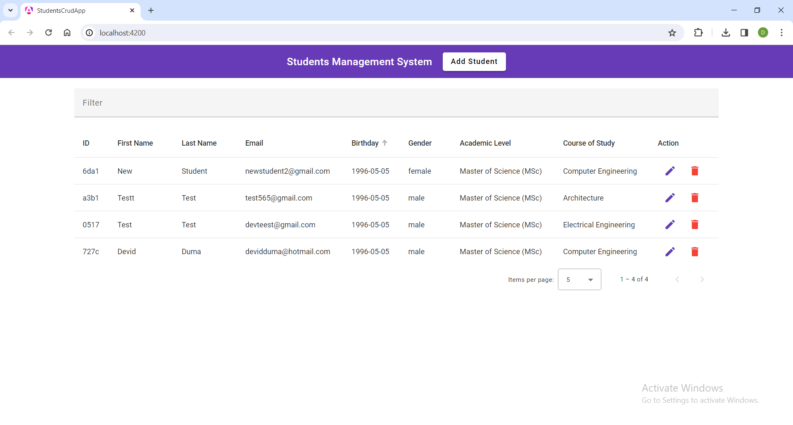
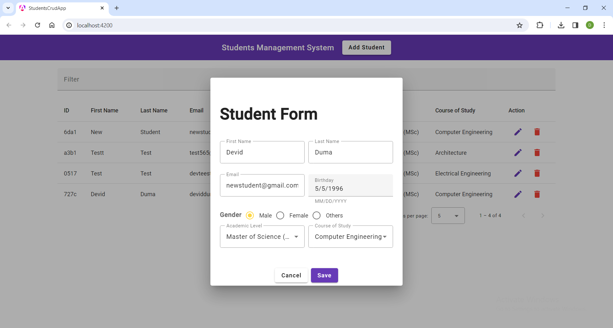
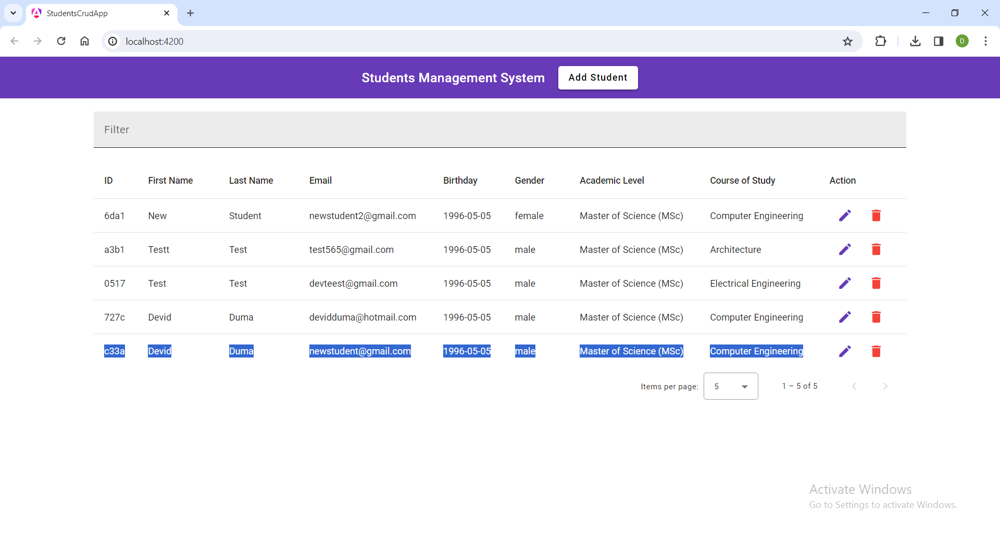
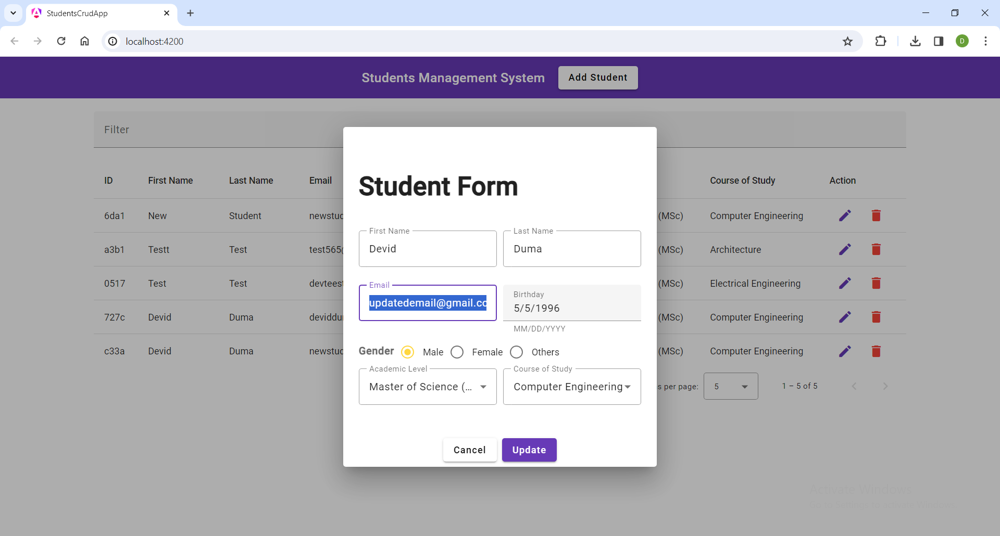
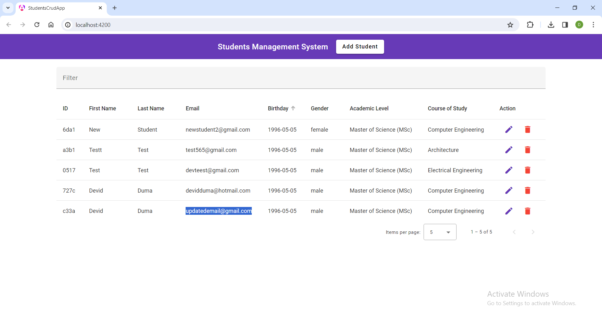

# Students Management System

Each university needs a management system for students. We build a CRUD application to create, read, update and delete data of students. Our software suggests a way to digitalize and automate the management process of student data in a typical university faculty.

It is necessary that the new system will manage to provide faster interaction with the students data through a well-defined web interface. For this reason, we use Angular framework and Angular Material component library to build a good web interface and modify components.

## Demonstration

| Read: Dashboard view                                        |
|-------------------------------------------------------------|
|  |

| Create: Add student form                                      | Student added successfully                                              |
|---------------------------------------------------------------|-------------------------------------------------------------------------|
|  |  |

| Update: Update email field of student                           | Email field updated successfully                               |
|-----------------------------------------------------------------|----------------------------------------------------------------|
|  |  |

| Delete: Student deleted successfully                                      |
|---------------------------------------------------------------------------|
|  |
